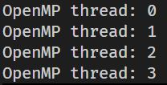

# 멀티 스레딩 모델 (user thread, kernel thread)

- 스레드에는 유저 스레드와 커널 스레드가 있습니다.

- 이전에 자바를 사용해서 스레드에 대한 실습을 진행했습니다. JVM은 가상 머신이고 운영체제가 아니기 때문에 자바에서 멀티 스레딩을 하더라도 그 스레드가 CPU 코어를 하나씩 점유하는 형태로 멀티 스레딩을 할 수는 없습니다. 이러한 스레드를 `유저 스레드`라고 합니다.

- 운영체제는 하드웨어에 직접 접근할 수 있기 때문에 스레드 하나에 CPU 코어 하나를 점유하도록 할 수 있습니다. 이러한 스레드를 `커널 스레드`라고 합니다.

- `유저 스레드`에 대한 보충 설명은 커널 모드가 아닌 유저 모드에서 커널 서포트 없이 실행되고 `커널 스레드`는 운영체제로부터 서포트를 받고 운영체제가 직접 관리하는 스레드입니다.

## 유저 스레드와 커널 스레드의 관계

- `Many-to-one Model` - CPU 코어에 할당된 하나의 커널 스레드가 여러개의 유저 스레드를 담당할 수 있습니다.

- `One-to-One Model` - 하나의 커널 스레드가 하나의 유저 스레드를 담당합니다.

- `Many-to-Many Model` - 여러개의 유저 스레드가 여러개의 커널 스레드의 도움을 받습니다.

## 스레드 라이브러리

- 스레드 라이브러리는 스레드를 생성하고 관리하는 API를 제공합니다.

- 오늘날 쓰이는 스레드 라이브러리는 대표적으로 POSIX Pthreads와 Windows thread, Java thread가 있습니다.

- POSIX Pthreads는 UNIX-like 운영체제에서 사용되고 Windows thread는 윈도우 운영체제에서 사용됩니다.

- Java thread는 커널 스레드의 도움이 필요하기 때문에 호스트 OS가 어떤 것인지에 따라 Pthreads를 이용하거나 Windows thread를 이용합니다.

## Pthreads

- Pthreads는 POSIX(IEEE 1003.1c)가 스레드 생성과 동기화를 위해 제정한 표준 API입니다.

- Pthreads는 스레드의 동작에 관한 명세일 뿐 스레드의 생성과 종료에 대한 구현은 아닙니다. 그렇지만 운영체제는 그 명세에 대한 구현을 사용자가 사용할 수 있도록 구현을 해두었습니다.

- pthreads.c에서 runner 함수는 Pthread로 생성한 스레드에게 할당할 작업을 의미합니다. 생성한 스레드에 runner를 수행하도록 하고 main 함수의 argv[] 인자를 전달하기 위해서(argv[0]은 실행 경로) `./a.out [숫자]`로 실행 파일을 실행하면 다음과 같은 결과를 얻을 수 있습니다.

- 

## 프로세스의 생성과 스레드 생성의 차이

- Pthreads2.c에서 `fork()`로 자식 프로세스를 생성하고 그 자식 프로세스는 스레드를 생성해서 스레드에 전역 변수의 값을 변경하는 작업을 수행하게 합니다.

- 이전에 `wait()` 시스템 콜을 실습하면서 프로세스의 생성을 하더라도 자식 프로세스는 새로운 자신만의 메모리 공간에 존재하기 때문에 영향을 주지 않는 것을 확인했습니다.

- 하지만 한 프로세스 스레드를 생성해서 변수의 값을 변경시키도록 하는 경우엔 프로세스의 값이 변경됩니다. 이유는 스레드는 그 프로세스 내의 자원과 데이터를 사용하기 때문에 스레드가 값을 변경하면 그 변수의 주소는 프로세스 내의 메모리 공간에 있는 같은 변수의 값을 변경시키는 것입니다.

- 

# 암묵적 스레딩

- 동시성과 병렬 실행을 프로그래머가 직접 제어하는 대신 컴파일러가 담당하게 하거나 라이브러리를 사용해서 쉽게 구현할 수 있습니다.

## 스레드 풀 (Thread Pools)

- 스레드 풀은 다수의 스레드를 생성해서 하나의 풀에 저장해두고 스레드가 필요할 때 꺼내서 사용할 수 있게 해줍니다.

## Fork & Join

- 명시적 스레딩 방식으로도 암묵적 스레딩을 할 수 있습니다.

## OpenMP

- 컴파일러 지시문과 API의 집합으로 C와 C++에서 암묵적 스레딩을 가능하게 해줍니다.

- OpenMP는 병렬 실행이 가능한 블록을 찾아서 병렬 영역으로 지정합니다. 검색된 병렬 영역에 컴파일러 지시문을 삽입합니다. 이 지시문은 OpenMP의 런타임 라이브러리에 해당 영역을 병렬로 실행하라고 지시합니다.

- 전처리기 지시문을 사용해 `#pragma omp parallel {}`의 중괄호 안에 병렬로 실행할 내용을 삽입하면 openMP 라이브러리가 해당 내용을 병렬 실행합니다.

- openmp1.c에서 문구의 출력은 한번 명시되어 있지만 병렬 실행이 되었기 때문에 실행 결과는 다음과 같습니다.

- 

- `omp_set_num_threads()`를 사용해 인자로 원하는 스레드의 총 수를 전달해 병렬 실행 될 스레드의 수를 지정할 수 있습니다.

- 

- 위 실행 결과에서 보이는 순서는 항상 보장되는 순서가 아닙니다.

## 병렬 실행의 효율성 증명

- 병렬 실행이 가능한 태스크인 openmp3.c의 천만개의 숫자를 더하는 작업을 병렬 실행을 했을 때와 그렇지 않을 경우 속도 차이가 발생하는지 확인을 해보겠습니다.

- `#pragma omp parallel for {}`구문을 사용해 반복문에 대한 병렬 실행을 할 것을 전처리기 지시문으로 명시합니다. openMP 라이브러리는 병렬 영역 안에 존재한는 반복문에 대한 병렬 처리를 스스로 할 수 있을 것입니다.

- 

- 병렬로 실행하지 않았을 때의 결과는 작업을 하는 데에 걸린 시간 중 유저 모드에서의 시간 0.42s와 커널 모드에서의 시간 0.24s를 합해서 total 시간으로 0.664s라는 결과가 나왔습니다.

- 병렬로 실행했을 때는 1.07s의 유저모드에서의 시간과 0.36s라는 커널 모드에서의 시간이 걸렸다고 나오지만 실제로 연산에 걸린 total 시간은 0.433s로 병렬로 실행하지 않은 경우보다 더 빠른 연산을 보였습니다. 

## 연습문제

- 

- 위 문제의 풀이는 다음과 같습니다.

- 첫번째 부모 프로세스 P1은 P2를 생성합니다. P1은 부모 프로세스이므로 `else`의 조건에 해당되어 모든 자식 프로세스들의 작업이 끝날 때 까지 `wait()`하게 됩니다. P2는 자식 프로세스가 없기 때문에 `pid1 == 0`의 조건에 해당되어 스레드를 생성하고 전역 변수 x를 10증가시킵니다.

- P2는 P3를 생성합니다. 이제 P2는 부모 프로세스가 되었기 때문에 `pid2 > 0` 조건에 해당되어 `wait()`하게 됩니다. P3는 계속 실행되어 P2의 메모리 공간을 복사하면서 가져온 변수 x의 값 20을 출력하고 종료됩니다.

- 이제 P2는 `wait()`를 끝내고 변수 x를 10 더 증가시킵니다. 그리고 변수 x의 값 30을 출력하고 종료됩니다.

- 모든 자식 프로세스들이 종료된 후 P1은 자신의 주소 공간에 명시된 변수 x에 할당된 값 10을 출력하고 종료됩니다.

- 그러므로 답은 `20 30 10` 2번입니다.