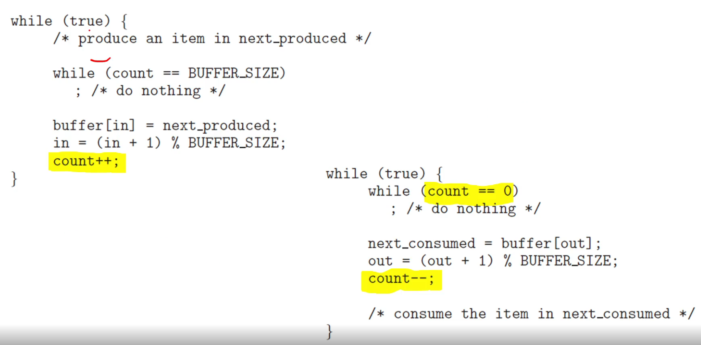

# 프로세스 동기화

- Cooperating 프로세스의 경우 메모리 주소 공간을 서로 공유하고 서로에게 영향을 미칩니다.

- 그런데 공유되는 데이터에 동시에 접근하는 경우 데이터의 불일치가 발생할 수 있습니다.

- 따라서 우리는 cooperating 프로세스 사이에 실행을 질서있게 유지하고 공유되는 주소 공간의 데이터 일치성을 유지해야 합니다.

## 데이터의 불일치

- 프로세스가 동시에 실행되는 경우 문맥교환이 일어나는데 instruction stream의 어느 지점에서 인터럽트가 발생할 지 명확하지 않습니다.

- 병렬 실행을 예로 들면 하나의 주소 공간에 분리된 코어에서 동작하는 프로세스가 동시에 접근하는 경우 데이터의 불일치가 발생할 수 있습니다.

# 생산자-소비자 문제에서의 데이터 불일치의 확인

- 

- `pthread1.c`와 `pthread2.c`의 실행 결과는 일관되지 않습니다.

- 

- 원인은 instruction stream의 어느 지점에서 문맥교환이 일어나는 지에 따라 결과가 달라지는 것입니다.

- count의 값을 5라고 가정하고 위에서부터 1번, 2번, 3번 지시문라고 명명하고 한 프로세스가 2번 지시문에서 값을 6으로 증가 시킨 상태이고 다음 지시문으로 넘어가기 전에 다른 프로세스로 문맥교환이 일어납니다.

- CPU를 새로 점유하게된 프로세스는 1번 지시문부터 실행이 되는데 여기서 register2가 복사해오는 count는 증가된 다음 새로 할당되어 저장되기 이전의 값인 5입니다. 2번 지시문을 실행해서 4로 감소시키고 감소시킨 값을 3번 지시문에 따라 count에 할당합니다.

- 다시 이전 프로세스로 문맥교환이 일어나고 마지막 3번 지시문을 수행하고 값은 6으로 덮어씌워집니다.

- 

- 이러한 문제 상황을 `경쟁 상태(Race Condition)`라고 부릅니다.